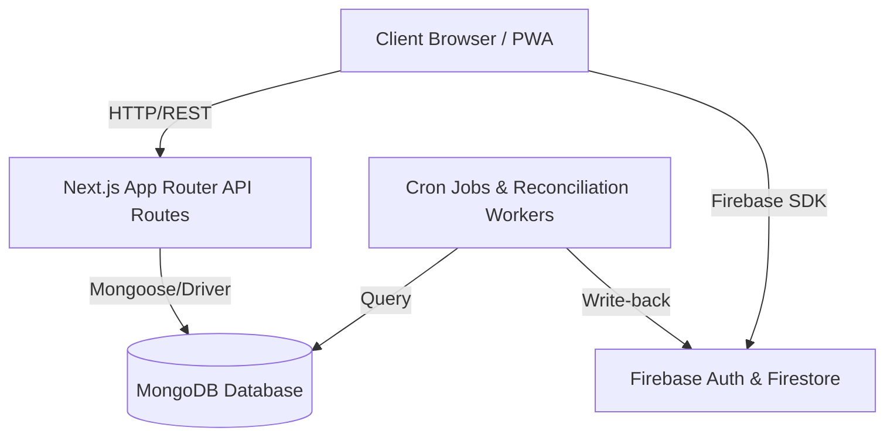

# Learnova Architecture & Technical Specification

This document provides a technical overview of Learnova's core architecture, system components, and key data flows.

## 🧱 Component Design & Directory Structure

- **`app/`**: Next.js App Router handles server pages, client dashboard routing, and administrative layouts.
- **`components/`**: Reusable component ecosystem (e.g., interactive planners, calendars, dashboards, charts).
- **`contexts/`**: Global React Context states (e.g., `AuthContext` managing current session token and RBAC policies).
- **`lib/`**: Unified client drivers, Firebase configuration, IndexedDB offline wrapper stores, and helper utilities.
- **`services/`**: Encapsulated service logic (e.g., database synchronization, background statistics, role synchronization).

---

## 🔒 Security & RBAC Model

Learnova implements a secure Role-Based Access Control (RBAC) pattern. The roles are defined as:
1. **Student**: Access to streaks, study decks, profile, attendance, and feedback metrics.
2. **Teacher**: Manage class attendance, schedules, curriculums, and notices.
3. **Institute**: Manage teachers, students, department-wide metrics.
4. **Admin**: Platform-level health diagnostics, global database maintenance, and billing.

RBAC is enforced via Next.js Edge Middleware checks (`middleware.js`) decoding the user session token and checking custom claims.

---

## 🔄 Offline Data Sync Flow

For low-connectivity environments (such as schools/institutes), Learnova uses a local-first offline queue model powered by IndexedDB (`lib/offlineStore.js`):

1. **Mutation capture**: If the network is down, state updates (e.g., attendance checks) are written to the local IndexedDB queue.
2. **Service Worker interception**: Online state changes are captured via standard Navigator bindings.
3. **Background Sync**: When the network is restored, `syncService.js` replays the pending transactions back to the Next.js sync endpoint.
4. **Reconciliation**: Server-side job schedules reconcile conflicts.
